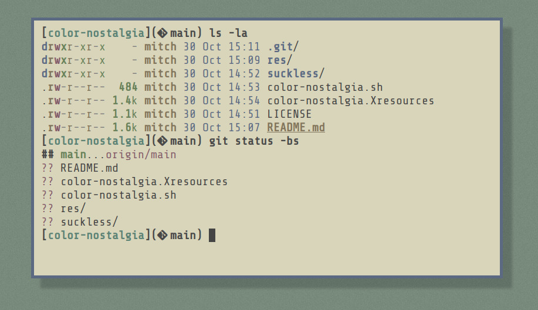
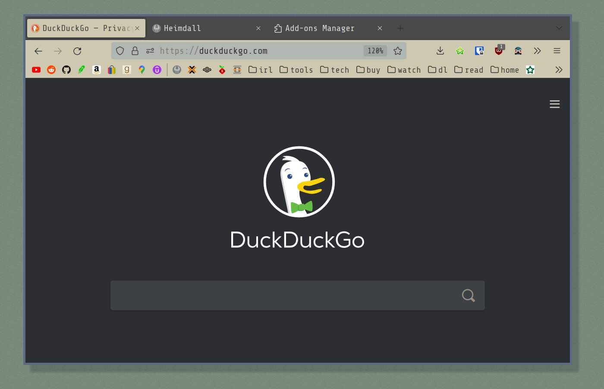

# color-nostalgia

A neutral yet colorful theme that brings about an odd sense of nostalgia.

## Preview




## Installation

### Xresources

1. Place this the `color-nostalgia.Xresources` file somewhere convenient
2. Include the file in your `~/.Xresources`
3. Make sure `xrdb load ~/.Xresources` is being called somewhere when
   you start your window manager.

```
#include "/home/mitch/src/dots/themes/color-nostalgia.Xresources"
```

### Sway

Place the provided .conf into `~/.config/sway/config.d`

Then add this to your sway config:

```
include ~/.config/sway/config.d/*.conf
client.focused   $color0 $background $foreground $color5 $color2
client.unfocused $color0 $background $foreground $color5 $color1
```

### Kitty

Place `kitty/color-nostalgia.conf` inside `~/.config/kitty`

Then at the top of your `~/.config/kitty.conf`:

```
include ./color-nostalgia.conf
```

### Firefox



**Option 1: Using Firefox Color**

1. Install the [Firefox Color](https://addons.mozilla.org/en-US/firefox/addon/firefox-color/) add-on
2. Click [here](https://color.firefox.com/?theme=XQAAAAJJAQAAAAAAAABBKYhm849SCia6aSqEGccwS-xMDPsqt5W6Vq5v8XDCcVNNOZ5Mg-9jNIDjg5_dCW6iHxYeY2hVOf8C-EbwwuGvaMEoH6ZTK0lGlvJofM3RLdp75zvojklIo251VyUl8fuWs_Mj_3XaLOPVLhMwASPEfgMr4zsUZ68CeWFyiAMQiaRob0pCWBvOrqUwrzIT-_JPUe1-ozX97f3TAvwbNeWmcoZicMecl9jDRauyU-RGeE-5V5XSbNDdnfeV2Ivpp1nprW8rgdGvBeU7L0MG4a6g_xnZVgA) to import the config

**Option 2: Theme Addon**

addon got taken down, todo

### Vim

This could potentially be improved but this is what I use for now:

```
set background=light
hi signColumn ctermbg=NONE
```

### i3

i3 can also grab from `~/.Xresources`

```
set_from_resource $fg foreground
set_from_resource $bg background
set_from_resource $foc_border   color4
set_from_resource $unfoc_border color2

# class                 border  backgr. text indicator child_border
client.focused          $foc_border     $bg     $fg  $bg       $foc_border
client.focused_inactive $bg             $bg     $fg  $bg       $unfoc_border
client.unfocused        $unfoc_border   $bg     $fg  $bg       $unfoc_border
client.urgent           $bg             $bg     $fg  $bg       $foc_border
client.placeholder      $bg             $bg     $fg  $bg       $foc_border

client.background       $bg
```

### Polybar

Polybar can grab colors from `~/.Xresources`, I recommend the below:

```
[colors]
background = ${xrdb:background}
foreground = ${xrdb:foreground}
foreground-alt = ${xrdb:color4}
primary = ${xrdb:color1}
secondary = ${xrdb:color5}
alert = ${xrdb:color3}
```

### Suckless

For suckless programs, see the headers in the `/suckless`
directory. You can include these with `#include` in your `config.h`

Note I have a many patches in my build, so the headers are built
with as much of the color capabilities turned on.  
May need to edit to fit your builds :)


## Tips

Looks really great with [redshift](https://github.com/jonls/redshift)!  
Example: [redshift.conf](https://github.com/mitchweaver/dots/blob/master/.config/redshift.conf)

## Like the theme?

Let me know!

If you themed a piece of software you use and want to contribute it make
a pull request or message me. 😁

----

### Credits

* **Inspiration**: Base colors from Joshua Stein's
    [sdorfehs](https://github.com/jcs/sdorfehs) desktop
* **Font used**: [Shure Tech Mono](https://github.com/ryanoasis/nerd-fonts/blob/master/patched-fonts/ShareTechMono/complete/Shure%20Tech%20Mono%20Nerd%20Font%20Complete%20Mono.ttf)

