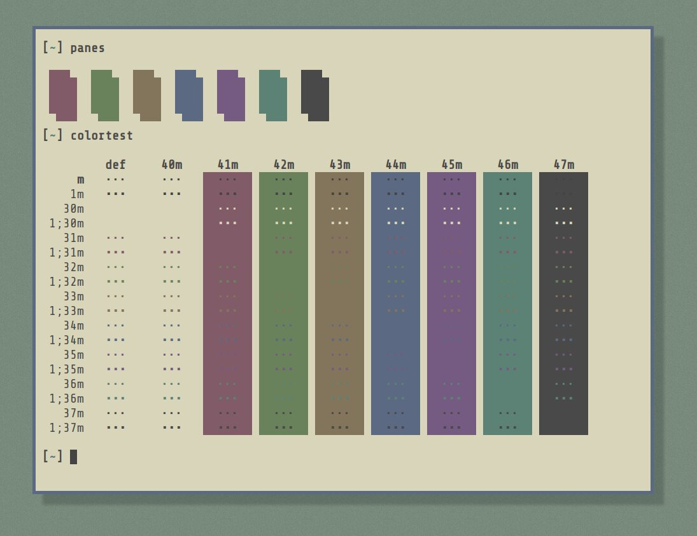

# color-nostalgia

## Preview




## Installation

### Xresources

1. Place this the `color-nostalgia.Xresources` file somewhere convenient
2. Include the file in your `~/.Xresources`
3. Make sure `xrdb load ~/.Xresources` is being called somewhere when
   you start your window manager.

```
#include "/home/mitch/src/dots/themes/color-nostalgia.Xresources"
```

### Polybar

Polybar can grab colors from `~/.Xresources`, I recommend the below:

```
[colors]
background = ${xrdb:background}
foreground = ${xrdb:foreground}
foreground-alt = ${xrdb:color4}
primary = ${xrdb:color1}
secondary = ${xrdb:color5}
alert = ${xrdb:color3}
```

### i3

i3 can also grab from `~/.Xresources`

```
set_from_resource $fg foreground
set_from_resource $bg background
set_from_resource $foc_border   color4
set_from_resource $unfoc_border color2

# class                 border  backgr. text indicator child_border
client.focused          $foc_border     $bg     $fg  $bg       $foc_border
client.focused_inactive $bg             $bg     $fg  $bg       $unfoc_border
client.unfocused        $unfoc_border   $bg     $fg  $bg       $unfoc_border
client.urgent           $bg             $bg     $fg  $bg       $foc_border
client.placeholder      $bg             $bg     $fg  $bg       $foc_border

client.background       $bg
```

### Suckless

For suckless programs, see the headers in the `/suckless`
directory. You can include these with `#include` in your `config.h`

Note I have a many patches in my build, so the headers are built
with as much of the color capabilities turned on.  
May need to edit to fit your builds :)

### Vim

This could potentially be improved but this is what I use for now:

```
set background=light
hi signColumn ctermbg=NONE
```

## Like the theme?

Let me know!

If you themed a piece of software you use and want to contribute it make
a pull request or message me. 😁
